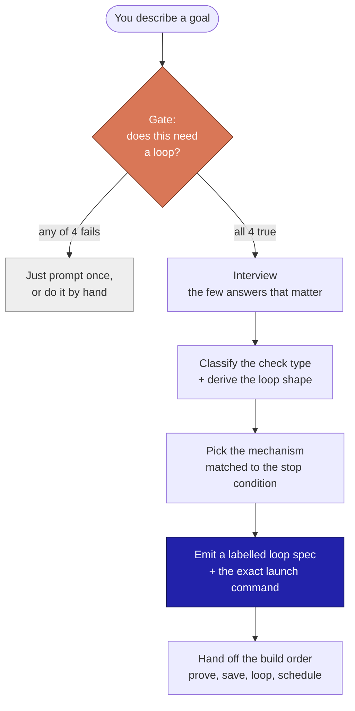

<div align="center">

# creating-agent-loops

**A Claude Code skill that turns a rough goal into a ready-to-run agent loop.**

It interviews you for the few answers that matter, then hands back a labelled loop spec plus the exact command to launch it.

[](LICENSE)
[](https://docs.claude.com/en/docs/claude-code)
[](#what-is-inside)
[](#install)

</div>

---

An **agent loop** is an LLM that calls tools, checks the result, and repeats toward a stated goal until it is done or you stop it. This skill is a *generator, not a catalog*: you describe what you want, and it builds one to fit, gating whether a loop is even the right tool before it builds anything.

> [!IMPORTANT]
> **A loop is only as good as its "done" check.** Without a real verify gate, the agent grades its own homework and is far too generous, so it produces confident, polished, wrong work and calls it finished. The check is what turns repetition into progress. Everything else is plumbing.

## How it works

You describe a goal in plain language. The skill walks a fixed process, in order, never skipping the gate:



1. **Gate** decides whether a loop is even the right tool. Most tasks are not loops; if yours is a predictable one-off, it tells you to just prompt once and stops there.
2. **Interview** explores the project first to answer what it can (language, test command, file layout, git state), then asks one thing at a time, each with a recommended answer you can just accept. It pins what "done" means, how it verifies, the guardrails, and the cadence; everything else gets a stated default.
3. **Classify and derive.** It names the check type (Functional, Visual, Judgment, or Human gate) and derives the loop shape (Solo, Maker to Checker, or Manager to Helpers) instead of asking. A Judgment check always gets a *separate* scorer.
4. **Pick the mechanism** matched to the stop condition: `/goal` to run until a condition is true, `/loop` for an interval, `/schedule` for an unattended cron, hooks for lifecycle events. It never picks a mechanism that cannot honor the stop.
5. **Emit** a ready loop: GOAL, SUCCESS CRITERIA, LOOP PROTOCOL with a real VERIFY step, STATE, GUARDRAILS, STOP WHEN (success plus a hard ceiling), ON STOP, plus the launch command, a cost cap, a stated-assumptions table, and (when a separate checker is used) a ready-to-paste checker brief with one pass example and one fail example.
6. **Build order**, every time: get one manual run reliable, save it as a skill, wrap it in a loop, then schedule it. Never schedule an unproven loop.

It always includes a hard stop, treats irreversible actions (delete, send, pay, deploy, merge) as a mandatory human gate, and is honest about cost (the metric that matters is **cost per accepted change**).

## The gate: does this even need a loop?

A loop is worth the setup only when **all four** are true. If any is clearly false, the skill says so and points you to the cheaper path.

| # | Condition | Cheaper path if it fails |
|---|---|---|
| 1 | **Iterative or recurring** (one run needs many unknown steps, or the task recurs ~weekly or more) | a predictable one-off, just write one good prompt |
| 2 | **A real verifier can reject bad output** (test, build, measurable condition, a rubric a separate agent scores, or a human who reviews each pass) | nothing can fail the work, so define a check first or do it by hand |
| 3 | **The agent can do it end to end**, not hand half back each pass | it cannot finish alone, keep a human in the loop for the manual part |
| 4 | **"Done" is objective, or can be made so** with a rubric | pure taste with nothing to check, you decide each time |

## Reference

### Check type (drives the VERIFY step)

| Type | When | How it checks |
|---|---|---|
| **Functional** | machine answers yes/no, zero opinion | tests pass, build compiles, number above X, regex match. Easiest, start here. |
| **Visual** | must be seen to be judged | UI, thumbnail, layout. The agent reads a screenshot. |
| **Judgment** | needs taste but a checklist exists | a *separate* agent scores against a rubric and a threshold. |
| **Human gate** | irreversible, or pure taste no rubric captures | the loop pauses, you approve, then it continues. |

### Loop shape (drives how many agents)

| Shape | When | Structure |
|---|---|---|
| **Solo** | start here, covers most work | one agent: reason, act, observe, repeat. |
| **Maker to Checker** | quality matters at high stakes, or gaming is a risk | a maker does the work, a *separate fresh* agent grades it so it cannot rubber-stamp itself. |
| **Manager to Helpers** | the job is big | a lead splits the goal and hands pieces to sub-agents in parallel. |

### Mechanism (match it to the stop condition)

| You want | Mechanism | Why |
|---|---|---|
| Run until a condition is true, in one sitting | `/goal "<condition>"` | a Stop hook blocks stopping until it holds, then auto-clears |
| Repeat on an interval (poll or maintain) | `/loop <interval> <prompt>` | re-runs every N; it does not stop itself, you do |
| Unattended on a daily or weekly schedule | `/schedule` | a cron cloud agent; results come to you |
| Fire at a lifecycle point (on stop, on edit) | hooks | runs commands around the agent's lifecycle |
| Split a big job across workers | sub-agents, or the Workflow tool | maker to checker, or manager to helpers |

> The rule that prevents the most common mistake: **never pick a mechanism that cannot satisfy the stop condition.** A "run until X is true" goal needs `/goal`, not `/loop` (which keeps re-running after the goal is met).

## What you get back

Ask for something like *"keep my test coverage above 90%"* and the skill hands back a filled, labelled spec plus the command to launch it:

```text
GOAL: line coverage of the test suite is at or above 90%, with every new test
      genuinely exercising the code it covers.

SUCCESS CRITERIA (strict, no soft passes):
  - the coverage tool reports total line coverage >= 90%
  - the full suite passes (no failing or skipped tests)
  - no test was deleted or weakened to lift the number

LOOP PROTOCOL (each pass):
  1. run the coverage tool, read the total and the least-covered file
  2. write tests for the real uncovered branches in ONE file
  3. VERIFY: re-run coverage and the suite. Then a SEPARATE checker agent reads
            the new tests and confirms each asserts real behavior (not a trivial
            pass). If the checker rejects any test, that test does not count.
  4. DECIDE: coverage >= 90% AND suite green AND checker approves? stop.
            else iterate on the next least-covered file.

STATE:     append one line to PROGRESS.md each pass (file treated, delta), commit.
GUARDRAILS: must NOT touch anything outside /src and /tests; never weaken a test.
STOP WHEN: criteria met OR after 12 passes, whichever comes first.
ON STOP:   report final coverage, files treated, any file left uncovered with why.
```

Launch: `/goal "test line coverage is >= 90% and the suite is green and no tests were weakened"`. Check type / shape: Functional / Maker to Checker. See [`templates/worked-examples.md`](creating-agent-loops/templates/worked-examples.md) for three loops built end to end (a Functional coding loop, a Judgment content loop, and a scheduled daily loop).

## Install

### Via the skills CLI

```bash
npx skills add gabrielsilvestri/creating-agent-loops --skill creating-agent-loops -g
```

### Manual (works everywhere)

Copy the inner `creating-agent-loops/` folder into your skills directory:

- Personal (all projects): `~/.claude/skills/creating-agent-loops/`
- Project-scoped: `<your-project>/.claude/skills/creating-agent-loops/`

```bash
git clone https://github.com/gabrielsilvestri/creating-agent-loops.git
cp -r creating-agent-loops/creating-agent-loops ~/.claude/skills/
```

## Use

In Claude Code, just describe a goal. The skill activates, runs the process above, and hands back the spec plus the command to launch it.

> "Create a loop that keeps my test coverage above 90%."
>
> "I want a loop that drafts one post a week and improves it until it is good."
>
> "Run a loop every morning that sends me my top priorities."

## What is inside

```text
creating-agent-loops/
  SKILL.md                    the process: gate, interview, classify, mechanism, emit, build order
  templates/
    loop-spec.md              the output contract to fill, plus a self-checking variant for any chat
    mechanism-map.md          how to map a loop to /goal, /loop, /schedule, hooks, and sub-agents
    worked-examples.md        three loops built end to end
```

## Why it is built this way

- **The gate comes first.** Most tasks are not loops. Building a loop for a predictable one-off just adds cost and a moving part; the skill would rather tell you to prompt once.
- **The check is the whole game.** A loop without a real verify step either self-certifies on half-finished work or never converges. Every emitted loop carries a concrete VERIFY beat and a hard ceiling.
- **The maker never grades itself.** For Judgment work, a separate scoring agent is mandatory; a single model grading its own output overgrades. That separation is most of the quality.
- **It states defaults instead of interrogating you.** It explores the project, asks only the consequential questions, and marks every assumption so you can correct a wrong guess in one read.
- **It is honest about cost.** Every pass re-sends growing context, and a maker plus a checker doubles the bill. The metric it optimizes is cost per accepted change, not raw passes.

## Credits

The skill distills four sources on agent loops:

- *"Agent loops, made simple"* (beginner guide): the reason-act-observe skeleton, the four check types, and that a loop is only as good as its done check.
- An audit of 45 real sources on what people mean by "agent loop": the invariant core (model, tools, state, goal, verify, stop) and the beginner build sequence.
- Anatoli Kopadze, *"Loops explained"*: the discover-plan-execute-verify-iterate cycle, the four-condition test for whether to loop, the five building blocks, cost per accepted change, and the build order.
- The Forward-Future [loop-library](https://signals.forwardfuture.ai/loop-library/): the catalog of pre-made loops this generator complements.

## License

MIT. See [LICENSE](LICENSE).
