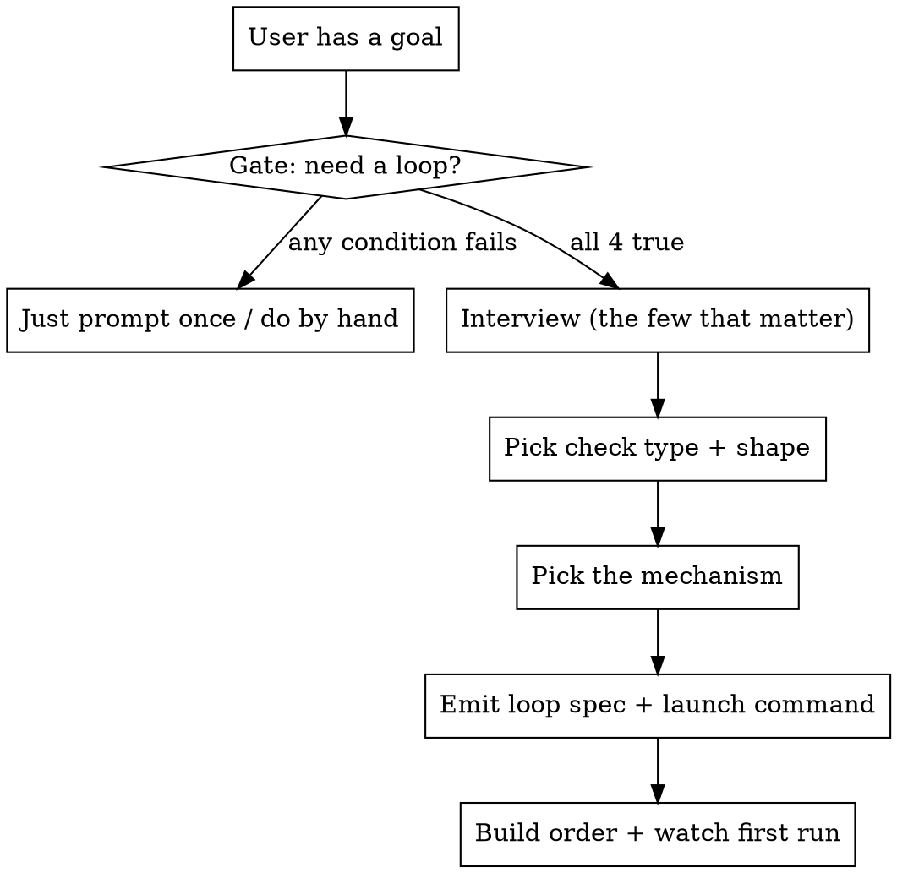

# Creating Agent Loops

## Overview

An agent loop is an LLM that calls tools, checks the result, and repeats toward a stated goal until it is done or you stop it. This skill turns a user's rough goal into a ready-to-run loop: it gates whether a loop is even the right tool, interviews the user for the few answers that matter, then emits a labelled loop spec plus the exact command to launch it.

**Core principle: a loop is only as good as its "done" check.** Without a real verify gate, the agent grades its own homework and the maker is far too generous, so it produces confident, polished, wrong work and calls it finished. The check is what turns repetition into progress. Everything else is plumbing.

This skill is a generator, not a catalog. For a catalog of pre-made loops to adapt, see the Forward-Future loop-library (install with `npx skills add Forward-Future/loop-library --skill loop-library -g`). Here you build one to fit.

## The process (follow in order, do not skip the gate)

Create a todo for each step below and work them in order.



### Step 0 - Gate: does this even need a loop?

A loop is worth the setup only when ALL FOUR are true. Assess from the user's goal; if any is clearly false, say so and recommend the cheaper path (one good prompt, or doing it by hand). Only escalate to the user when it is genuinely borderline.

1. **It is iterative or recurring** either one run needs many unknown steps converging on a checkable end (you cannot one-shot it), OR the task recurs often (roughly weekly or more) so a saved or scheduled loop pays back its setup. A true one-off with a predictable path is better served by one good prompt.
2. **Bad output can be rejected by some verifier that is real and wired in** a machine check (test, build, lint, type-check, measurable condition), a rubric you can actually write down and have a separate agent score, OR a human who will actually review each pass. Any of the four check types in Step 2 counts, not only machine checks. What does NOT count: "someone could object someday". If nothing concrete can fail the work, the loop just spins.
3. **The agent can do it end-to-end** not hand half back to you every pass.
4. **"Done" is objective, or can be made so** not pure taste with nothing to check against. If quality is a judgment call, a rubric scored by a separate agent makes it checkable; if even that is impossible, a human still wins.

If a condition fails, recommend the matching cheaper path: a predictable one-off -> one good prompt; nothing can fail the work -> define a check first or do it by hand; the agent cannot finish it alone -> keep a human in the loop for the manual part; done is pure taste -> you decide each time, or build a rubric so it becomes checkable. If the work is irreversible AND unreviewable, do not loop it unattended. When in doubt, prefer the simplest thing that could work, and show it before any heavier version.

### Step 1 - Interview: explore first, then ask one thing at a time

The interview is a short walk down a decision tree, not a form. Detect the user's language from their first message and use it throughout. Three rules:

- **Explore before you ask.** Anything you can answer by looking, look: inspect the project (language, test/build command, file layout, which tools or connectors exist, git state) and answer from that. Only ask what exploration cannot settle.
- **One question at a time, each with a recommended answer.** Lead with your recommendation so the user can just say yes; do not dump a form.
- **Resolve dependencies in order**, because later choices hang off earlier ones:

1. **Goal -> done-definition.** Restate the goal as one checkable sentence. Push for something a machine or a rubric could check ("every test in /tests passes", not "make it good"). This becomes the success criteria.
2. **Done-definition -> check type.** Pick Functional / Visual / Judgment / Human gate (Step 2). Confirm the check is actually runnable here (the test, tool, or connector exists and the agent can reach it); a check the agent cannot run is not a check.
3. **Check type + size -> shape.** Derive it in Step 2; do not ask.
4. **Cadence -> mechanism.** Run once until done, every N, on a schedule, or on an event (Step 3 derives the mechanism).
5. **Guardrails.** What must it never touch, and is there an irreversible step (delete, send, pay, deploy, merge)?

Derive the stop ceiling too (heuristic below) and confirm it; never leave it unset.

**Stop-ceiling heuristic:** estimate how many passes the work plausibly takes, multiply by about 1.5, then clamp: minimum 3, maximum 20 for a solo loop, maximum 8 for maker/checker (the checker doubles per-pass cost). These caps are defaults: raise them when each pass is cheap (e.g. fast unit tests) and lower them when each pass is expensive. State the estimate and any raise. For a goal with no natural end ("keep the repo clean forever"), the loop must NOT run forever: bound each RUN with a per-run ceiling and put the recurrence in the cadence (a schedule), so every run is finite even though the schedule repeats.

**If the user wants it now with no questions, or cannot or will not give a concrete done-definition:** do not stall. Pin down the done-definition only (the one slot you cannot guess), fill every other slot with a stated default, and mark each assumption in the spec so the user can correct it. If they truly cannot define done even as a rubric, the check type defaults to Human gate: the loop pauses for the user to judge each pass.

**Reconcile contradictions.** If answers conflict (e.g. "fully automatic" but "I must approve every output"), surface the conflict to the user and resolve it together before emitting, never silently dropping either answer: a mandatory human approval means the cadence is not fully unattended and the check type includes a Human gate.

### Step 2 - Pick the check type and the loop shape

**Check type** (drives the VERIFY beat of the loop):

| Type | When | How it checks |
|---|---|---|
| **Functional** | machine answers yes/no, zero opinion | tests pass, build compiles, app runs, number above X, word count, regex match. Easiest, start here. |
| **Visual** | must be seen to be judged | UI, thumbnail, layout. Agent looks at a screenshot. |
| **Judgment** | needs taste but a checklist exists | a SEPARATE agent scores against a rubric/threshold. |
| **Human gate** | irreversible, pure taste no rubric captures, or "done" cannot be defined even as a rubric | loop pauses, user approves, then continues. |

If the user's check is Judgment, Visual, or Human, say so plainly and wire the matching mechanism (a second scoring agent, a screenshot read, or a pause). The most common failure is silently treating a Judgment task as if a number could check it. If the success criteria mix types (e.g. "tests pass AND it reads well"), split them: each criterion gets its own matching check, the functional ones machine-checked and the judgment ones scored by a separate agent. Do not collapse a mixed goal into one type and drop the rest.

**Loop shape** (drives how many agents):

| Shape | When | Structure |
|---|---|---|
| **Solo loop** | start here, covers most work | one agent: reason, act, observe, repeat. For low-stakes Judgment, a self-grade pass inside this one agent is acceptable with an explicit caveat (it is not a true Judgment check). |
| **Maker -> Checker** | quality matters at high stakes, or gaming is a risk | maker does the work, a SEPARATE fresh agent grades it so it cannot rubber-stamp itself. Writer can be fast/cheap, reviewer slow/strict. That separation is most of the quality. |
| **Manager -> Helpers** | the job is big | a lead splits the goal and hands pieces to sub-agents in parallel |

**Derive the shape, do not ask for it.** Judgment check type -> Maker -> Checker (the scorer MUST be a different agent than the maker, or it grades its own homework), unless it is explicitly low-stakes, where a self-grade with a caveat is acceptable (see the Solo row). Functional or Visual at low stakes -> Solo. Functional or Visual at high stakes -> Maker -> Checker. A job too big for one agent's context, or that splits into independent parts -> Manager -> Helpers. For Manager -> Helpers, put the ceiling on the manager's rounds (not per helper), and tell the manager what to do when a helper fails or stalls: retry once, then record that piece as unfinished and move on, never block the whole loop on one helper.

**Stakes, concretely:** high-stakes = the output ships to a client, gets published, costs real money, or is expensive to redo; low-stakes = an internal draft or prototype the user reviews before it goes anywhere, or a lightweight personal notification the user just receives and does not act on irreversibly. For a Judgment task, a single-model self-grade is acceptable ONLY at low stakes and only as a draft; at high stakes use a separate scorer. A checker only helps if it can actually fail the work: give it the rubric with a concrete example of a pass and a fail; if it scores everything 8+ on the first pass, the rubric is too vague, tighten it. If the user named a shape that conflicts with the derived one (e.g. "a solo loop with a judgment check"), surface the conflict and explain why the derived shape is required.

### Step 3 - Pick the mechanism (match it to the stop condition)

Map the cadence answer to the Claude Code mechanism. The rule that prevents the most common mistake: **never pick a mechanism that cannot satisfy the stop condition.** (A "run until X is true" goal needs `/goal`, not `/loop`; `/loop` re-runs on an interval and does not stop itself when the goal is met.)

| Cadence / trigger | Mechanism | Why |
|---|---|---|
| Run until a condition is true, in one sitting | `/goal "<condition>"` | a Stop hook blocks stopping until the condition holds, then auto-clears |
| Repeat on an interval (poll/maintain) | `/loop <interval> <prompt>` or `/loop <prompt>` (self-paced) | re-runs the prompt every N; you stop it |
| Unattended on a daily/weekly schedule | `/schedule` (cron cloud agent) | wakes on cron, results come to you |
| Fire at a lifecycle point (on stop, on edit) | hooks | runs commands around the agent's lifecycle |
| Big job split across workers | sub-agents, or the Workflow tool for deterministic fan-out (roughly 8+ parallel pieces, or control flow over many items) | maker/checker or manager/helpers |

See `templates/mechanism-map.md` for exact syntax and how these compose (e.g. `/goal` running a saved skill, hooks that sanitize output, a cron that calls a skill).

### Step 4 - Emit the loop spec + launch command

Fill `templates/loop-spec.md` with the answers and hand it to the user, followed by the exact command to launch it. Every emitted loop has these labelled parts, in this order:

```
GOAL: <one checkable sentence>
SUCCESS CRITERIA (strict, no soft passes):
  - <criterion>
  - <criterion>
LOOP PROTOCOL (each pass):
  1. <gather context / state the single next step>
  2. <do ONE thing>
  3. VERIFY: <the concrete check> -> if it fails, name the weakest point
  4. DECIDE: all criteria pass? stop. else iterate, fixing the weakest first
STATE: <progress file + commit each pass, if it runs longer than one session>
GUARDRAILS: must NOT touch <...>; pause before <irreversible action>
STOP WHEN: <success> OR <hard ceiling: N passes / token budget / time>
ON STOP: <summarize what changed and what still fails>
```

Then add, every time:
- the **launch command** (exact), plus a one-line note on WHY this mechanism honors the stop condition;
- the **check type and shape** in one line;
- a one-line **cost / iteration cap**;
- a **stated-assumptions table** (columns: assumption, default chosen, how to correct) for everything you inferred or could not confirm, so the user can fix any wrong guess in one read;
- when the shape is Maker -> Checker, a **ready-to-paste checker brief**: the exact rubric the separate scorer applies, with at least one concrete example of a pass and one of a fail, so the gate is real and not vague. For a user who wants to run it by hand in any chat (no coding agent), offer the self-checking variant: PLAN, DO, VERIFY (score each criterion 1-10 against an external standard, not its own previous draft, brutally honest), DECIDE (all 8+ -> FINAL, else ITERATING and fix the weakest first). See `templates/worked-examples.md` for three fully worked loops.

Before the user launches, present the filled spec and get a quick confirmation (skip the wait only if they told you to just do it). Fixing the spec is cheap; fixing a bad run is not.

### Step 5 - Hand off the build order, tell them to watch the first run

Loops blow up when scheduled before they are proven. Give the build order every time:

1. Get ONE manual run reliable by hand.
2. Turn that into a skill (save the instructions) so the loop reads them each run.
3. Wrap the skill in a loop (add the gate + stop condition).
4. THEN put it on a schedule.

For anything scheduled or unattended, do NOT set up the schedule until step 1 is proven. Offer to save the spec as a reusable skill file, and tell the user to watch the first run live and fix the instructions (not the output) where it trips.

## Cost (state it, do not bury it)

Every pass re-sends growing context, so 10 passes is not 10 prompts, it is 10 ever-bigger ones; a maker plus checker doubles the bill. Rough order: one medium task, single agent, ~50k-200k tokens; fleets multiply. The metric that matters is **cost per accepted change**: below roughly a 50% accept rate the loop costs more than it gives back. Always include a hard ceiling: a loop without a real gate either self-certifies completion on half-finished work or never converges, and either way it spends in silence until the ceiling stops it.

## Common mistakes

| Mistake | Fix |
|---|---|
| No verify step | wire a concrete check every pass; it is the step that makes the loop converge instead of drift |
| Agent self-certifies "done" on half-finished work | the VERIFY step must run an external test, rubric, or human gate, never the maker's own opinion of what it just produced |
| Vague goal ("improve the code") | one checkable sentence with a done-state |
| No stop condition | success OR a hard ceiling, always; the model may not stop itself |
| Wrong mechanism for the stop | until-true needs `/goal`, not `/loop`; match mechanism to the stop condition |
| Too much per pass | one change per pass converges; "fix everything" thrashes |
| Dangerous tools too early | scope permissions; open a PR, do not merge/deploy/delete on run 1 |
| No state file | past one context window it forgets and repeats; write progress + commit |
| Treating Judgment as Functional | if it needs taste, use a rubric + a separate scoring agent, or a human gate |
| Scheduling before proving | run manual once first; never schedule an unproven loop |
| Cognitive surrender | stay the reviewer, especially early; watch the first runs |

## Tricky cases

| Situation | Handling |
|---|---|
| Not running in Claude Code (plain chat, API script, CI) | the slash mechanisms do not exist; hand over the self-checking variant (see loop-spec template) and map the heartbeat to that environment: cron + an API/CLI call, a CI trigger, or an external orchestrator |
| Wants a schedule AND a hard end ("every morning until the launch ships") | put the recurrence in `/schedule` and give each run its own stop condition; add a SCHEDULE END line (a date estimate or a max-run count) and tell the user to set a reminder to cancel the routine once the end condition is met (a schedule has no built-in until-true) |
| User wants the irreversible step with no human pause | the human gate before an irreversible, unreviewable action is mandatory and cannot be removed; keep it, or do not loop that step unattended |
| Skill invoked from inside a running loop or sub-agent | a sub-agent cannot issue top-level slash commands; emit the spec as plain instructions plus the verify/stop logic, and note the launch command is for the user to run at the top level |
| Success is an absence over time ("no errors for 24h") | the VERIFY step must observe the window (re-check after the elapsed time), not declare success on first clean reading; the ceiling must be at least the window, else move the recurrence to a schedule instead of one long run |
| Not in Claude Code but needs a real checker | run two separate model calls (one to produce, one to score against the rubric) so the grader never sees the maker's reasoning; the single-prompt self-checking variant in the loop-spec template is the light path but cannot give real separation |
| A schedule may fire again before the last run finishes | add a lock: a run-in-progress marker the run sets and clears, and skip if it is already set, so concurrent instances do not corrupt shared state |
| A Human gate in an unattended or scheduled run | a cron agent has no interactive prompt; route the approval to an async channel (a push notification or message the user replies to, or queue it for the next interactive session) and do not take the gated action until the reply arrives |

## Output rules

- Never use em dashes or en dashes in any generated artifact; use commas, parentheses, colons, or separate sentences.
- Show the simplest loop that could work before any heavier (fleet/multi-agent) version. Most users need the light version.
- State your defaults instead of asking about everything; ask only the consequential questions.
